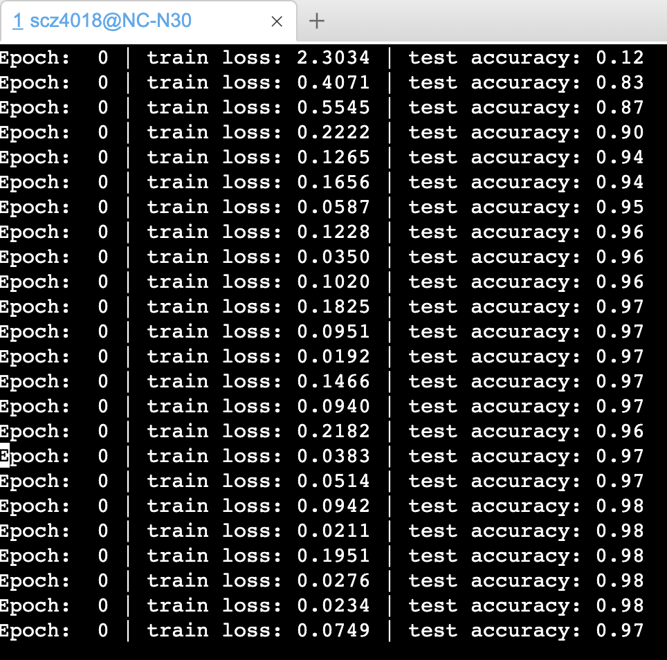

并行云平台采用任务提交式的方式运行程序，使用起来较为复杂。并行云平台适合利用脚本直接运行程序。故大家可以在组内服务器上先行debug，保证代码正确后再利用脚本提交运行。

为了方便同学们使用并行云平台，现在提供一个简单的例子。

我们的例子是希望在平台上跑手写数字识别任务。

我们连接北京超级云scx6387的超算账号，这个账号下有8张40G A100的机器。

我们需要将数据、代码上传，并配置环境、提交程序，最后查看结果。

1. 上传数据。

打开快传应用，选择指定目录位置，点击上传按钮，将数据集上传解压。

2. 上传代码。

与上传数据一致，或者使用git等。

3. 配置环境。

第一步，要配置软件环境（cuda、anaconda等）。

使用module avail查看已有的软件。

使用module load 加载软件。module list查看已加载的软件。

第二步，利用anaconda配置python环境。

conda create --name zhangchao python=3.8

conda activate zhangchao

北京超算：（
pip install /home/bingxing2/apps/package/pytorch/1.13.1+cu117_cp38/*.whl

安装对应版本的pytorch，需要源码编译。

cat /home/bingxing2/apps/package/pytorch/1.13.1+cu117_cp38/env.sh

安装完成后可在对应目录下查看env.sh信息。

不需要GPU的模块可以直接pip或conda安装，pip源一定要使用默认配置的源。）

4. 提交程序。

sbatch --gpus=1 run.sh

parajobs查看状态

5. 查看结果

查看*.out的文件。

可以修改日志的保存路径

sbatch -o 日志文件名

sbatch -e 错误文件名

